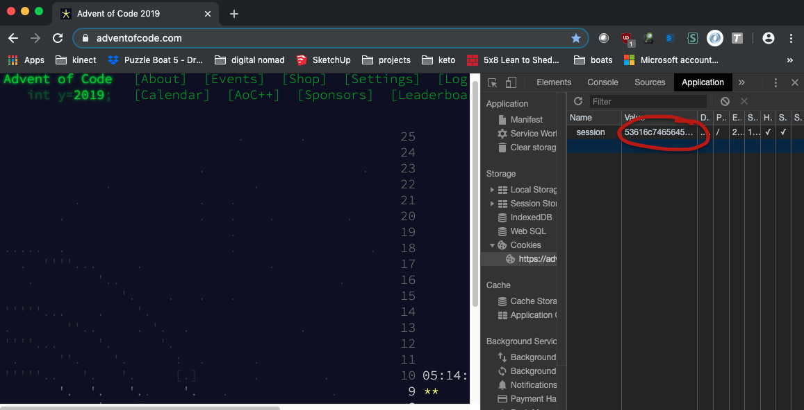

# [Advent of Code](http://adventofcode.com) solutions in C#
My first experiences with C# came long ago in the early 00s, but I've only started using it seriously in the last few months. I have done a handful of the AoC challenges thru the years in various languages, but in an attempt to get more comfortable with some of the exciting C# features, I'm going to try to solve all of the previous years challenges and store the results here. In the first few weeks I've already started cobbling a set of utilites and tools to make doing these challenges a bit easier.

# .Net Core AoC Project Template
I got tired of performing the same boring work to prep a new C# project for the next day's contest, so I took the time to learn how to make a dotnet project template. The template(s) I've created are stored in this repository in the dotnetTemplates folder. My base AoC project template creates a new project with some common imports and a little bit of hepler-class infrastructure.

To install this template for your own use, simply add it to your `dotnet new` list
```
dotnet new -i /path/to/dotnetTemplates/working/templates/aoc
```
To create a new AoC project, invoke the `dotnet new aoc` command:
```
dotnet new aoc --output path/to/my/project/folder --year 2019 --day 10
```
You'll end up with a new project called `2019_10.csproj` in the folder you specified. The class will be similarly named, and automatically include the Util method invocation to fetch the input data from https://adventofcode.com/2019/day/10/input. You'll need to add a file in your repository root directory called `session_cookie` with the exact value of the `session` cookie from your signed-in adventofcode.com account.


Note: all file paths and so forth for this repository are relative to the folder containing the csproj folder. If you invoke the `dotnet run` command from the csproj folder, or if you run the project from Visual Studio, it should execute fine. `input` files will be stored in `<repo_root>/inputs`, and the session cookie file needs to be in the repo root folder also.


To remove the template, just uninstall with a very similar path. Note: for uninstall, the target path must be absolute, not relative
```
dotnet new -u /path/to/dotnetTemplates/working/templates/aoc
```
